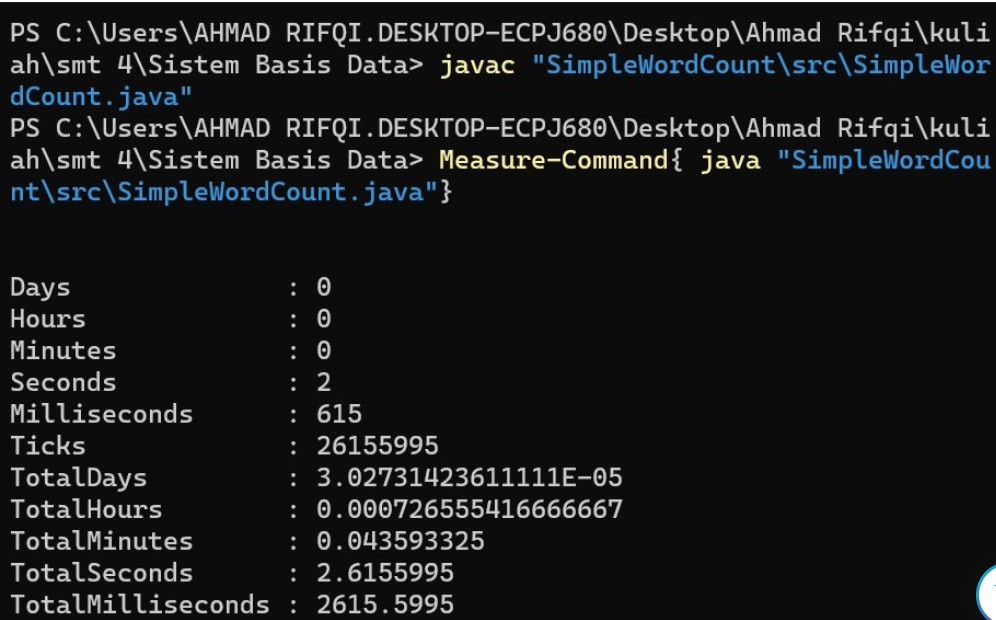
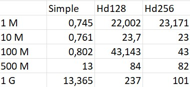
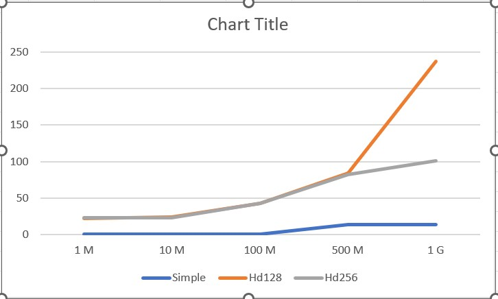

# Instalasi Hadoop
Hadoop Install Tutorial
A. Install Development Kit 8 (JDK 8) windows x64
Link diakses disini:
https://www.oracle.com/java/technologies/downloads/#java8
[Install JDK](Images/installJDK.png)


# Pembandingan waktu eksekusi wordcount biasa dengan hadoop

## A. Langkah-langkah percobaan
1. Mempersiapkan file text berukuran 1 MB, 10 MB, 100 MB, 500 MB, dan 1 GB
File file diatas dapat dicari di link :
- http://textfiles.com/etext/FICTION/alcott-little-261.txt
- https://www.i3s.unice.fr/~jplozi/hadooplab_lsds_2015/datasets/

2. Membuat kode  `SimpleWordCount.java`


3. Mengcompile program java SimpleWordCount

```
javac /namaFileWordCount.java
```


4. Mengukur kecepatan eksekusi program java
```
measure-command{java [compiled java] [path_to_input]}
```


5. Lakukan langkah 2 sampai 4 untuk berbagai ukuran file

6. Menyalakan hadoop dengan command `start-all.cmd.`
note: run as administrator, pindah direktori ke hadoop/sbin

7. Membuat direktori tempat input
```
hadoop fs -mkdir [nama_direktori]
```

8. Menyimpan file input ke direktori
```
hadoop fs -put [path_to_input] [nama_direktori]
```

9. Menjalankan wordcount hadoop
```
hadoop jar [path to snapshot.JAR] [main_class name] [input_directory] [output_directory]
```

10. Menjalankan command 7 - 9. Command no 8 diganti dengan:
```
hdfs dfs -D dfs.blocksize=[Ukuran blok dalam satuan byte] -put [path_to_input.txt] [inputFolder]
```

## B. Hasil (Tabel dan Grafik)





## C. Analysis

Pada percobaan SimpleWordCount, durasi eksekusi input berukuran 1MB, 10MB dan 100MB tidak banyak berbeda karena ketiga file tersebut memiliki keragaman kata yang rendah sehingga tidak banyak melakukan operasi tambahan untuk menambahkan kata baru ke daftar. Sementara file berukuran 500MB dan 1GB memiliki keragaman kata yang tinggi sehingga memerlukan waktu tambahan untuk menambahkan kata baru ke daftar (untuk mengalokasikan memory)

Pada percobaan hadoop dengan blok berukuran 128 dan blok berukuran 256 terdapat perbedaan durasi eksekusi pada input berukuran 1GB. Hal ini karena tiap blok  merupakan aplikasi tersendiri dengan jvm tersendiri yang membutuhkan ruang memory. Karena keseluruhan percobaan dijalankan di sistem tunggal, jumlah blok yang sedikit berarti aplikasi yang sedikit sehingga tidak banyak overhead untuk menciptakan process jvm tersendiri. Sementara itu, untuk input file berukuran 500MB dan dibawah nya tidak banyak perbedaan karena perangkat memiliki cukup RAM untuk menjalankan beberapa process wordcount secara concurrent. 

Pada keseluruhan percobaan, program hadoop membutuhkan waktu yang lebih lama. Hal ini disebabkan oleh banyaknya pekerjaan yang dilakukan oleh hadoop. Pekerjaan-pekerjaan tersebut diantaranya,menginisiasi resource, melakukan mapping, split lalu proses wordcount (reduce). Sementara program SimpleWordCount berjalan lebih cepat karena tidak ada proses mapping dan split. Hal ini menunjukkan bahwa hadoop cocok digunakan untuk menangani data berukuran sangat besar yang tersimpan secara terdistribusi. Sementara program wordcount cocok digunakan pada sistem tunggal dengan data berukuran kecil sampai berukuran beberapa gigabyte
