<!-- TABLE OF CONTENTS -->
<details>
  <summary>Table of Contents</summary>
  <ol>
    <li>
      <a href="#about-the-project">About The Project</a>
      <ul>
        <li><a href="#built-with">Built With</a></li>
      </ul>
    </li>
    <li>
      <a href="#Introduction-to-Big-Dat-and-Map-Reduce">Introduction to Big Data and Map Reduce</a>
      <ul>
        <li><a href="#big-data">Big Data</a></li>
        <li><a href="#map-reduce">Map Reduce</a></li>
      </ul>
    </li>
    <li>
      <a href="#tutorial">Tutorial Instalasi</a>
      <ul>
        <li><a href="#langkah-percobaan">Langkah-Langkah Percobaan</a></li>
        <li><a href="#hasil">Hasil (Tabel dan Grafik)</a></li>
        <li><a href="#analisis">Analisis</a></li>
      </ul>
    </li>
    <li>
      <a href="#word-count">Pembandingan waktu eksekusi wordcount biasa dengan hadoop</a>
      <ul>
        <li><a href="#instal-java">Menginstal Development Kit 8 (JDK 8) windows x64</a></li>
        <li><a href="#instal-hadoop">Instalasi Hadoop</a></li>
      </ul>
    </li>
    <li><a href="#contributions">Contributions</a></li>
  </ol>
</details>


<!-- ABOUT THE PROJECT -->
## About The Project

Pada era big data, pentingnya menganalisis dan memproses jumlah informasi teks yang sangat besar telah meningkat pesat dalam berbagai industri dan bidang penelitian. Penghitungan kata adalah salah satu operasi dasar dalam analisis teks yang digunakan untuk tugas seperti pemrosesan bahasa, analisis sentimen, dan pengambilan informasi. Namun, program penghitung kata tradisional terbatas dalam kemampuan mereka mengelola dataset besar karena mereka hanya dapat memproses data secara berurutan pada satu mesin.

Dalam proyek ini, kami akan mengembangkan dua versi Program Word Counter: yang pertama menggunakan teknik pemrograman berurutan tradisional, dan yang kedua memanfaatkan kemampuan komputasi terdistribusi Hadoop. Versi berurutan akan menerapkan algoritma sederhana untuk menghitung kemunculan kata dalam file teks yang diberikan, sementara versi Hadoop akan menggunakan sistem file terdistribusi (HDFS) dan model pemrograman MapReduce.


<p align="right">(<a href="#readme-top">back to top</a>)</p>


### Built With

* [![Java][Java]][Java-url]
JRE 1.8 — Offline installer for JRE
Java Development Kit — 1.8
* [![Hadoop][Hadoop]][Hadoop-url]

<p align="right">(<a href="#readme-top">back to top</a>)</p>

<!-- INTRODUCTION-->
## Introduction to Big Data and Map Reduce

### Big Data

Big data menggambarkan dataset yang sangat besar dan rumit yang ditandai oleh volume, kecepatan, dan variasi. Pengelolaan big data melibatkan pengolahan volume data yang sangat besar dan melebihi kemampuan metode manajemen dan analisis data konvensional. Ini mencakup dataset yang memiliki ukuran mulai dari terabyte hingga eksabyte, dihasilkan dengan cepat, dan membutuhkan pemrosesan waktu nyata atau hampir waktu nyata. Data terstruktur, semi-terstruktur, dan tidak terstruktur hanyalah beberapa contoh jenis dan format data yang beragam yang termasuk dalam big data.

Perhatian terhadap big data dapat diatasi oleh kerangka kerja komputasi terdistribusi dan skalabel Hadoop, yang memungkinkan penyimpanan, pemrosesan, dan analisis data melintasi kumpulan perangkat keras yang terjangkau. Model pemrograman MapReduce memungkinkan pemrosesan paralel untuk analisis big data yang efektif, sementara Hadoop Distributed File System (HDFS) menjamin toleransi kesalahan dan ketersediaan data.

### Map Reduce

Kegiatan pemrosesan data dibagi menjadi dua tahap: map dan reduce, menggunakan gaya pemrograman dan kerangka kerja komputasi yang dikenal dengan nama MapReduce.

Pada tahap map, data input dibagi dan diproses secara bersamaan di beberapa node, menghasilkan pasangan kunci-nilai sementara. Data sementara kemudian digabungkan dan diproses lebih lanjut untuk menghasilkan output akhir pada tahap reduksi. Dengan memanfaatkan kemampuan komputasi terdistribusi dari klaster Hadoop, MapReduce secara otomatis mengatur penyebaran data, toleransi kesalahan, dan eksekusi paralel. Para pengembang dapat fokus pada implementasi fungsi map dan reduce, sedangkan Hadoop mengelola infrastruktur yang mendasarinya, karena menyediakan solusi yang skalabel dan toleran terhadap kesalahan untuk memproses dan menganalisis dataset dalam skala besar.

<p align="right">(<a href="#readme-top">back to top</a>)</p>


## Tutorial Instalasi

### Menginstal Development Kit 8 (JDK 8) windows x64
1. Anda dapat mengklik tautan ini:
https://www.oracle.com/java/technologies/downloads/#java8 <br> 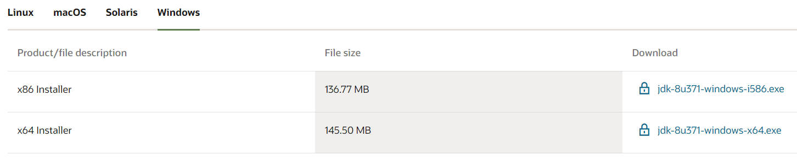

2. Klik _agreement box_ kemudian klik **Download jdk-8u371-windows-x64.exe** <br> 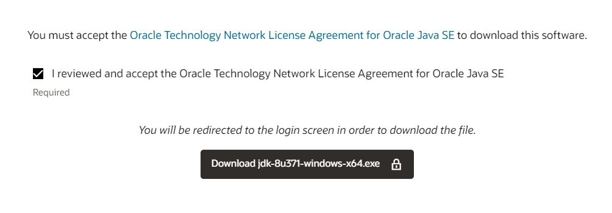

3. Anda akan diarahkan ke web Oracle untuk melakukan pengunduhan.

**_Notes:_**
- Apabila Anda sudah Sign In, maka file akan secara otomatis terunduh.
- Jika belum, Anda akan diminta untuk Sign In terlebih dahulu.
- Jika Anda belum memiliki akun Oracle, maka buatlah akun terlebih dahulu.

  


4. Setelah file berhasil diunduh, buka JDK file. <br> 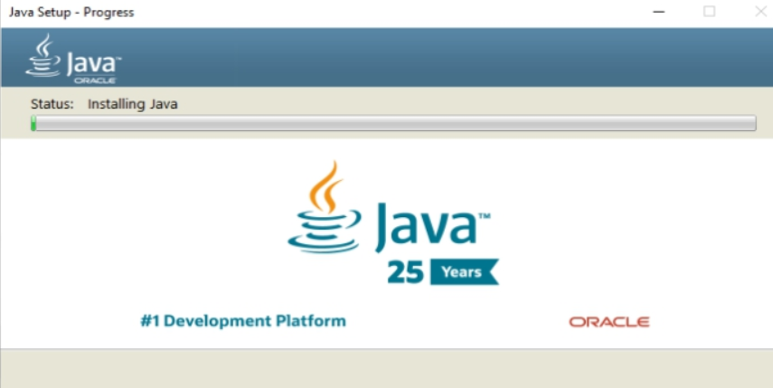

5. Buka **environment variable** di **system properties** <br> 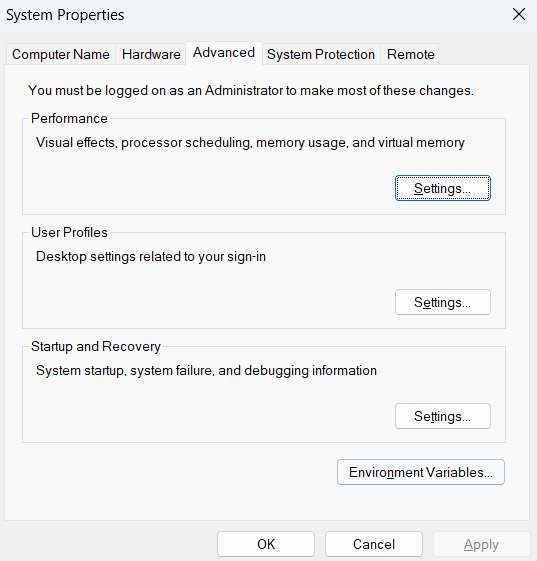

6. Buat variabel pengguna baru bernama `JAVA_HOME` <br> 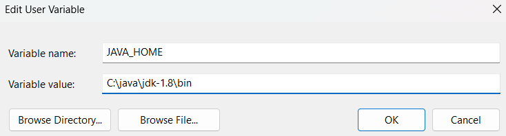

7. Atur Path Java pada System Variable, klik New dan isi dengan direktori  `jdk\bin`. <br> 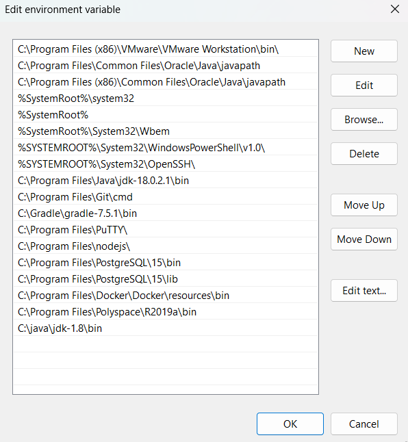

8. Buka cmd untuk memverifikasi instalasi <br> 

<p align="right">(<a href="#readme-top">back to top</a>)</p>


### Instalasi Hadoop
1. Kita akan menggunakan Hadoop versi 2.9.2. Link download:
https://hadoop.apache.org/release/2.9.2.html 

2. Klik **Download tar.gz** <br> 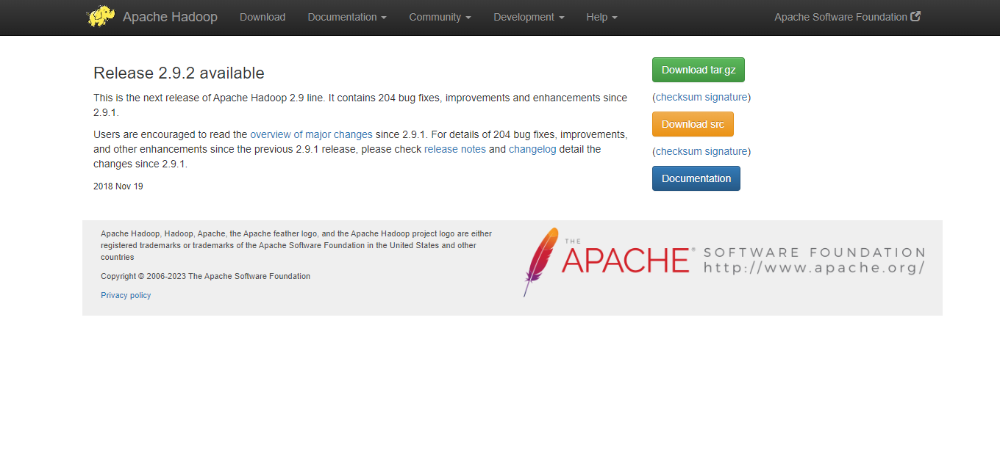

3. Pindahkan file `tar.gz` yang diunduh ke **Disk C**, kemudian ekstrak Hadoop pada **Disk C**. <br> 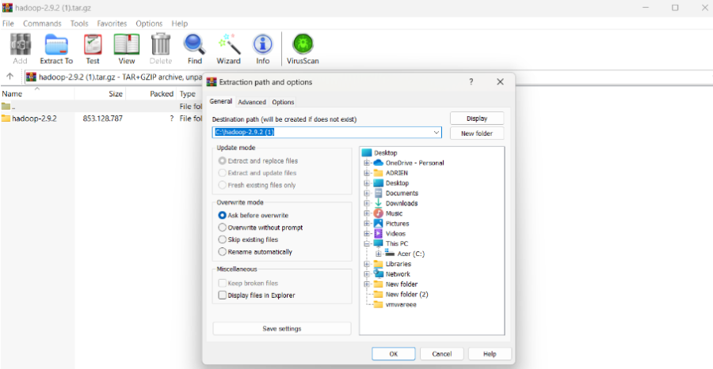

4. Klik **close** pada _pop up window_ di bawah ini setelah ekstrak berhasil dilakukan. <br> 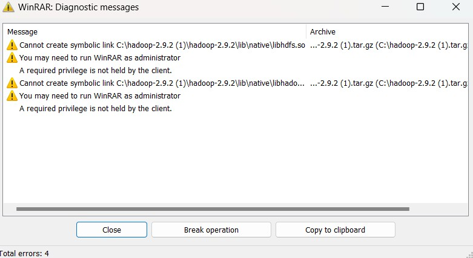

5. Ganti nama folder Hadoop 2.9.2 menjadi hadoop <br> 

6. Melakukan konfigurasi terhadap file hadoop dengan membuka folder hadoop → etc → hadoop. Kemudian buka file core-site.xml, mapred-site.xml , yarn-site.xml, hdfs-site.xml, dan hadoop-env.cmd di text editor. 

7. Menambahkan kode pada core-site.xml <br> 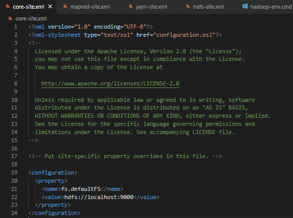
```
  <property>
    <name>fs.defaultFS</name>
    <value>hdfs://localhost:9000</value>
  </property>
```

8. Menambahkan kode pada mapred-site.xml <br> 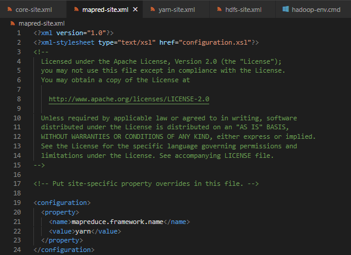
```
  <property>
    <name>mapreduce.framework.name</name>
    <value>yarn</value>
  </property>

```

9. Menambahkan kode pada file  yarn-site.xml <br> 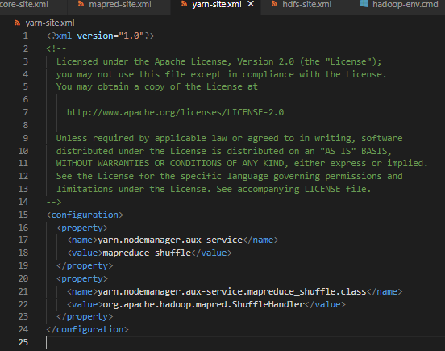
```
  <property>
    <name>yarn.nodemanager.aux-service</name>
    <value>mapreduce_shuffle</value>
  </property>

  <property>
    <name>yarn.nodemanager.aux-service.mapreduce_shuffle.class</name>
    <value>org.apache.hadoop.mapred.ShuffleHandler</value>
  </property>
```


10. Membuat 2 folder baru dengan nama datanode dan namenode. <br> 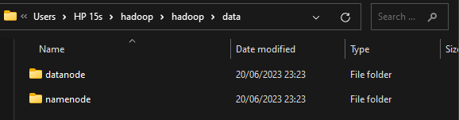

11. Menambahkan kode pada hdfs-site.xml <br> 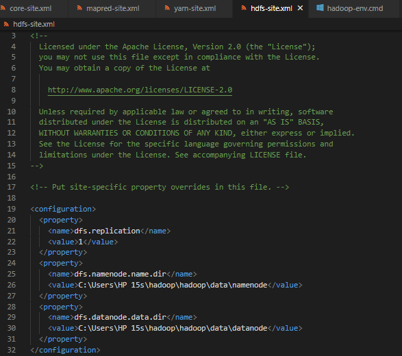
```
   <property>
    <name>dfs.replication</name>
    <value>1</value>
  </property>
  <property>
    <name>dfs.namenode.name.dir</name>
    <value>C:\Users\HP 15s\hadoop\hadoop\data\namenode</value>
  </property> 
  <property>
    <name>dfs.datanode.data.dir</name>
    <value>C:\Users\HP 15s\hadoop\hadoop\data\datanode</value>
  </property>
```

12. Menyesuaikan direktori JAVA_HOME dengan direktori java jdk pada file hadoop-env.cmd pada **line 25** <br> 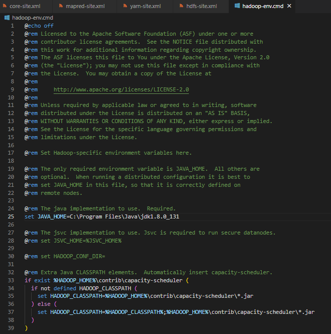

13. Mengatur environment variable pada **Hadoop**

14. Membuat user variable bernama `HADOOP_HOME` dengan value bernama `hadoop\bin`. <br> 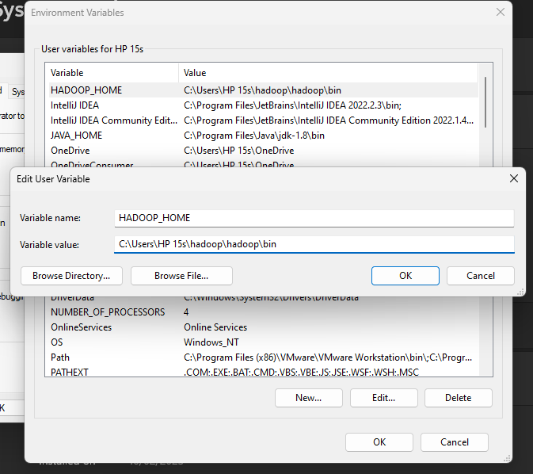

15. Mengatur path hadoop pada system variable dengan mengisi direktori `hadoop\bin` dan `hadoop\sbin` <br> 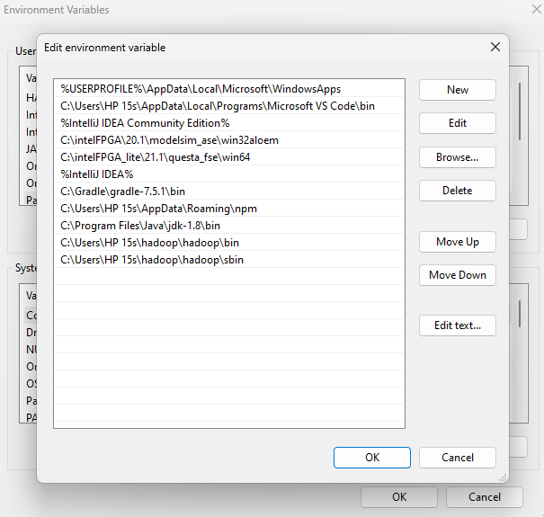

16. Mendownload path file hadoop agar dapat berjalan pada windows, link: https://github.com/cdarlint/winutils/tree/master/hadoop-2.9.2/bin <br> 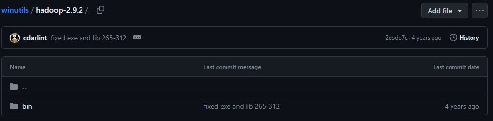

17. Ekstrak file tersebut, lalu ubah folder bin pada hadoop menjadi folder yang telah di ekstrak tersebut <br> _Sebelum :_ <br> 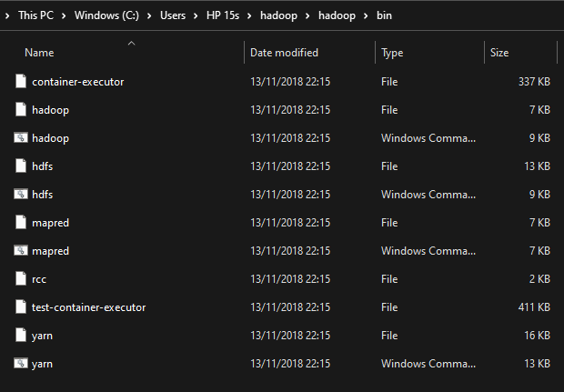 <br> _Sesudah :_ <br> 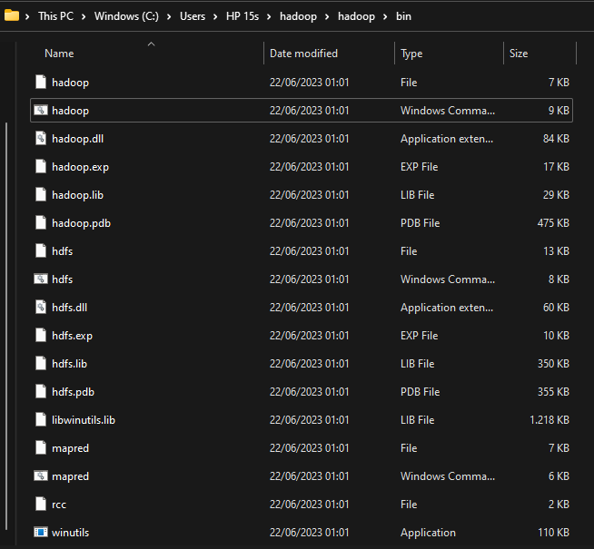

<p align="right">(<a href="#readme-top">back to top</a>)</p>

## Pembandingan waktu eksekusi wordcount biasa dengan hadoop

### Langkah-langkah percobaan
1. Mempersiapkan file text berukuran 1 MB, 10 MB, 100 MB, 500 MB, dan 1 GB
File file diatas dapat dicari di link :
- http://textfiles.com/etext/FICTION/alcott-little-261.txt
- https://www.i3s.unice.fr/~jplozi/hadooplab_lsds_2015/datasets/

2. Membuat kode  `SimpleWordCount.java`. Source Code dapat dilihat pada link : https://github.com/bernanda0/wordcounting 

3. Mengcompile program java SimpleWordCount

```
javac /namaFileWordCount.java
```


4. Mengukur kecepatan eksekusi program java
```
measure-command{java [compiled java] [path_to_input]}
```
<br> 

5. Lakukan langkah 2 sampai 4 untuk berbagai ukuran file

6. Menyalakan hadoop dengan command `start-all.cmd.`
note: run as administrator, pindah direktori ke hadoop/sbin

7. Membuat direktori tempat input
```
hadoop fs -mkdir [nama_direktori]
```

8. Menyimpan file input ke direktori
```
hadoop fs -put [path_to_input] [nama_direktori]
```

9. Menjalankan wordcount hadoop
```
hadoop jar [path to snapshot.JAR] [main_class name] [input_directory] [output_directory]
```

10. Menjalankan command 7 - 9. Command no 8 diganti dengan:
```
hdfs dfs -D dfs.blocksize=[Ukuran blok dalam satuan byte] -put [path_to_input.txt] [inputFolder]
```
<p align="right">(<a href="#readme-top">back to top</a>)</p>

### Hasil (Tabel dan Grafik)

Berikut merupakan data yang didapatkan pada input file dengan ukuran berbeda : 

**Tabel** <br> 

**Grafik** <br> 

<p align="right">(<a href="#readme-top">back to top</a>)</p>


### Analisis

Pada percobaan SimpleWordCount, durasi eksekusi input berukuran 1MB, 10MB dan 100MB tidak banyak berbeda karena ketiga file tersebut memiliki keragaman kata yang rendah sehingga tidak banyak melakukan operasi tambahan untuk menambahkan kata baru ke daftar. Sementara file berukuran 500MB dan 1GB memiliki keragaman kata yang tinggi sehingga memerlukan waktu tambahan untuk menambahkan kata baru ke daftar (untuk mengalokasikan memory)

Pada percobaan hadoop dengan blok berukuran 128 dan blok berukuran 256 terdapat perbedaan durasi eksekusi pada input berukuran 1GB. Hal ini karena tiap blok  merupakan aplikasi tersendiri dengan jvm tersendiri yang membutuhkan ruang memory. Karena keseluruhan percobaan dijalankan di sistem tunggal, jumlah blok yang sedikit berarti aplikasi yang sedikit sehingga tidak banyak overhead untuk menciptakan process jvm tersendiri. Sementara itu, untuk input file berukuran 500MB dan dibawah nya tidak banyak perbedaan karena perangkat memiliki cukup RAM untuk menjalankan beberapa process wordcount secara concurrent. 

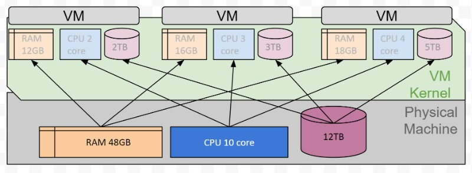

(Sumber : https://www.google.com/url?sa=i&url=https%3A%2F%2Factusdigital.com%2F2018%2F01%2F08%2Fvirtual-machine-or-physical-server%2F&psig=AOvVaw1mojJw_gjNTUSN1o0U267f&ust=1687451264286000&source=images&cd=vfe&ved=0CBEQjRxqFwoTCLjFkfvj1P8CFQAAAAAdAAAAABAE )

Pada keseluruhan percobaan, program hadoop membutuhkan waktu yang lebih lama. Hal ini disebabkan oleh banyaknya pekerjaan yang dilakukan oleh hadoop. Pekerjaan-pekerjaan tersebut diantaranya,menginisiasi resource, melakukan mapping, split lalu proses wordcount (reduce). Sementara program SimpleWordCount berjalan lebih cepat karena tidak ada proses mapping dan split. Hal ini menunjukkan bahwa hadoop cocok digunakan untuk menangani data berukuran sangat besar yang tersimpan secara terdistribusi. Sementara program wordcount cocok digunakan pada sistem tunggal dengan data berukuran kecil sampai berukuran beberapa gigabyte

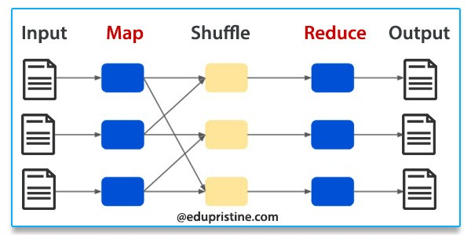

(Sumber : https://www.google.com/url?sa=i&url=https%3A%2F%2Fwww.edupristine.com%2Fblog%2Fhadoop-mapreduce-framework&psig=AOvVaw0szHTM_mFvaeqOXWFVn_Sb&ust=1687451326777000&source=images&cd=vfe&ved=0CBEQjRxqFwoTCKDv_5jk1P8CFQAAAAAdAAAAABAE)

<p align="right">(<a href="#readme-top">back to top</a>)</p>

<!-- CONTRIBUTORS -->
## Contributors

Alifya Zhafira Ananda - [alifyaza](https://github.com/alifyaza)

Ahmad Rifqi - [AhmadRifqi86](https://github.com/AhmadRifqi86)

Azzah Angely - [azzahangely](https://github.com/azzahangely)

Adrien Ardra Ramadhan - [adrien1811](https://github.com/adrien1811)

Project Link: [SBDK2Group3](https://github.com/azzahangely/SBDK2Group3)

<p align="right">(<a href="#readme-top">back to top</a>)</p>


<!-- MARKDOWN LINKS & IMAGES -->
<!-- https://www.markdownguide.org/basic-syntax/#reference-style-links -->
[Java]: https://img.shields.io/badge/Java-ED8B00?style=for-the-badge&logo=openjdk&logoColor=white
[Java-url]: https://www.oracle.com/java/technologies/javase/javase-jdk8-downloads.html#license-lightbox
[Hadoop]: https://img.shields.io/badge/Apache%20Hadoop-66CCFF?style=for-the-badge&logo=apachehadoop&logoColor=black
[Hadoop-url]: https://archive.apache.org/dist/hadoop/core/hadoop-2.9.2/hadoop-2.9.2.tar.gz

