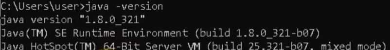

# Intro to Mapreduce


# Tutorial Instalasi Hadoop

## A. Menginstal Development Kit 8 (JDK 8) windows x64
1. Anda dapat mengklik tautan ini:
https://www.oracle.com/java/technologies/downloads/#java8 <br> 

2. Klik _agreement box_ kemudian klik **Download jdk-8u371-windows-x64.exe** <br> 

3. Anda akan diarahkan ke web Oracle untuk melakukan pengunduhan.

**_Notes:_**
- Apabila Anda sudah Sign In, maka file akan secara otomatis terunduh.
- Jika belum, Anda akan diminta untuk Sign In terlebih dahulu.
- Jika Anda belum memiliki akun Oracle, maka buatlah akun terlebih dahulu.

  


4. Setelah file berhasil diunduh, buka JDK file. <br> 

5. Buka **environment variable** di **system properties** <br> 

6. Buat variabel pengguna baru bernama `JAVA_HOME` <br> 

7. Atur Path Java pada System Variable, klik New dan isi dengan direktori  `jdk\bin`. <br> 

8. Buka cmd untuk memverifikasi instalasi <br> 


## B. Instalasi Hadoop
1. Kita akan menggunakan Hadoop versi 2.9.2. Link download:
https://hadoop.apache.org/release/2.9.2.html 

2. Klik **Download tar.gz** <br> 

3. Pindahkan file `tar.gz` yang diunduh ke **Disk C**, kemudian ekstrak Hadoop pada **Disk C**. <br> 

4. Klik **close** pada _pop up window_ di bawah ini setelah ekstrak berhasil dilakukan. <br> 

5. Ganti nama folder Hadoop 2.9.2 menjadi hadoop <br> 

6. Melakukan konfigurasi terhadap file hadoop dengan membuka folder hadoop → etc → hadoop. Kemudian buka file core-site.xml, mapred-site.xml , yarn-site.xml, hdfs-site.xml, dan hadoop-env.cmd di text editor. 

7. Menambahkan kode pada core-site.xml <br> 
```
  <property>
    <name>fs.defaultFS</name>
    <value>hdfs://localhost:9000</value>
  </property>
```

8. Menambahkan kode pada mapred-site.xml <br> 
```
  <property>
    <name>mapreduce.framework.name</name>
    <value>yarn</value>
  </property>

```

9. Menambahkan kode pada file  yarn-site.xml <br> 
```
  <property>
    <name>yarn.nodemanager.aux-service</name>
    <value>mapreduce_shuffle</value>
  </property>

  <property>
    <name>yarn.nodemanager.aux-service.mapreduce_shuffle.class</name>
    <value>org.apache.hadoop.mapred.ShuffleHandler</value>
  </property>
```


10. Membuat 2 folder baru dengan nama datanode dan namenode. <br> 

11. Menambahkan kode pada hdfs-site.xml <br> 
```
   <property>
    <name>dfs.replication</name>
    <value>1</value>
  </property>
  <property>
    <name>dfs.namenode.name.dir</name>
    <value>C:\Users\HP 15s\hadoop\hadoop\data\namenode</value>
  </property> 
  <property>
    <name>dfs.datanode.data.dir</name>
    <value>C:\Users\HP 15s\hadoop\hadoop\data\datanode</value>
  </property>
```

12. Menyesuaikan direktori JAVA_HOME dengan direktori java jdk pada file hadoop-env.cmd pada **line 25** <br> 

13. Mengatur environment variable pada **Hadoop**

14. Membuat user variable bernama `HADOOP_HOME` dengan value bernama `hadoop\bin`. <br> 

15. Mengatur path hadoop pada system variable dengan mengisi direktori `hadoop\bin` dan `hadoop\sbin` <br> 

16. Mendownload path file hadoop agar dapat berjalan pada windows, link: https://github.com/cdarlint/winutils/tree/master/hadoop-2.9.2/bin <br> 

17. Ekstrak file tersebut, lalu ubah folder bin pada hadoop menjadi folder yang telah di ekstrak tersebut <br> _Sebelum :_ <br>  <br> _Sesudah :_ <br> 


# Pembandingan waktu eksekusi wordcount biasa dengan hadoop

## A. Langkah-langkah percobaan
1. Mempersiapkan file text berukuran 1 MB, 10 MB, 100 MB, 500 MB, dan 1 GB
File file diatas dapat dicari di link :
- http://textfiles.com/etext/FICTION/alcott-little-261.txt
- https://www.i3s.unice.fr/~jplozi/hadooplab_lsds_2015/datasets/

2. Membuat kode  `SimpleWordCount.java`. Source Code dapat dilihat pada link : https://github.com/bernanda0/wordcounting 

3. Mengcompile program java SimpleWordCount

```
javac /namaFileWordCount.java
```


4. Mengukur kecepatan eksekusi program java
```
measure-command{java [compiled java] [path_to_input]}
```


5. Lakukan langkah 2 sampai 4 untuk berbagai ukuran file

6. Menyalakan hadoop dengan command `start-all.cmd.`
note: run as administrator, pindah direktori ke hadoop/sbin

7. Membuat direktori tempat input
```
hadoop fs -mkdir [nama_direktori]
```

8. Menyimpan file input ke direktori
```
hadoop fs -put [path_to_input] [nama_direktori]
```

9. Menjalankan wordcount hadoop
```
hadoop jar [path to snapshot.JAR] [main_class name] [input_directory] [output_directory]
```

10. Menjalankan command 7 - 9. Command no 8 diganti dengan:
```
hdfs dfs -D dfs.blocksize=[Ukuran blok dalam satuan byte] -put [path_to_input.txt] [inputFolder]
```

## B. Hasil (Tabel dan Grafik)

Berikut merupakan data yang didapatkan pada input file dengan ukuran berbeda : 

**Tabel**


**Grafik**


## C. Analysis

Pada percobaan SimpleWordCount, durasi eksekusi input berukuran 1MB, 10MB dan 100MB tidak banyak berbeda karena ketiga file tersebut memiliki keragaman kata yang rendah sehingga tidak banyak melakukan operasi tambahan untuk menambahkan kata baru ke daftar. Sementara file berukuran 500MB dan 1GB memiliki keragaman kata yang tinggi sehingga memerlukan waktu tambahan untuk menambahkan kata baru ke daftar (untuk mengalokasikan memory)

Pada percobaan hadoop dengan blok berukuran 128 dan blok berukuran 256 terdapat perbedaan durasi eksekusi pada input berukuran 1GB. Hal ini karena tiap blok  merupakan aplikasi tersendiri dengan jvm tersendiri yang membutuhkan ruang memory. Karena keseluruhan percobaan dijalankan di sistem tunggal, jumlah blok yang sedikit berarti aplikasi yang sedikit sehingga tidak banyak overhead untuk menciptakan process jvm tersendiri. Sementara itu, untuk input file berukuran 500MB dan dibawah nya tidak banyak perbedaan karena perangkat memiliki cukup RAM untuk menjalankan beberapa process wordcount secara concurrent. 


(Sumber : https://www.google.com/url?sa=i&url=https%3A%2F%2Factusdigital.com%2F2018%2F01%2F08%2Fvirtual-machine-or-physical-server%2F&psig=AOvVaw1mojJw_gjNTUSN1o0U267f&ust=1687451264286000&source=images&cd=vfe&ved=0CBEQjRxqFwoTCLjFkfvj1P8CFQAAAAAdAAAAABAE )

Pada keseluruhan percobaan, program hadoop membutuhkan waktu yang lebih lama. Hal ini disebabkan oleh banyaknya pekerjaan yang dilakukan oleh hadoop. Pekerjaan-pekerjaan tersebut diantaranya,menginisiasi resource, melakukan mapping, split lalu proses wordcount (reduce). Sementara program SimpleWordCount berjalan lebih cepat karena tidak ada proses mapping dan split. Hal ini menunjukkan bahwa hadoop cocok digunakan untuk menangani data berukuran sangat besar yang tersimpan secara terdistribusi. Sementara program wordcount cocok digunakan pada sistem tunggal dengan data berukuran kecil sampai berukuran beberapa gigabyte


(Sumber : https://www.google.com/url?sa=i&url=https%3A%2F%2Fwww.edupristine.com%2Fblog%2Fhadoop-mapreduce-framework&psig=AOvVaw0szHTM_mFvaeqOXWFVn_Sb&ust=1687451326777000&source=images&cd=vfe&ved=0CBEQjRxqFwoTCKDv_5jk1P8CFQAAAAAdAAAAABAE)
